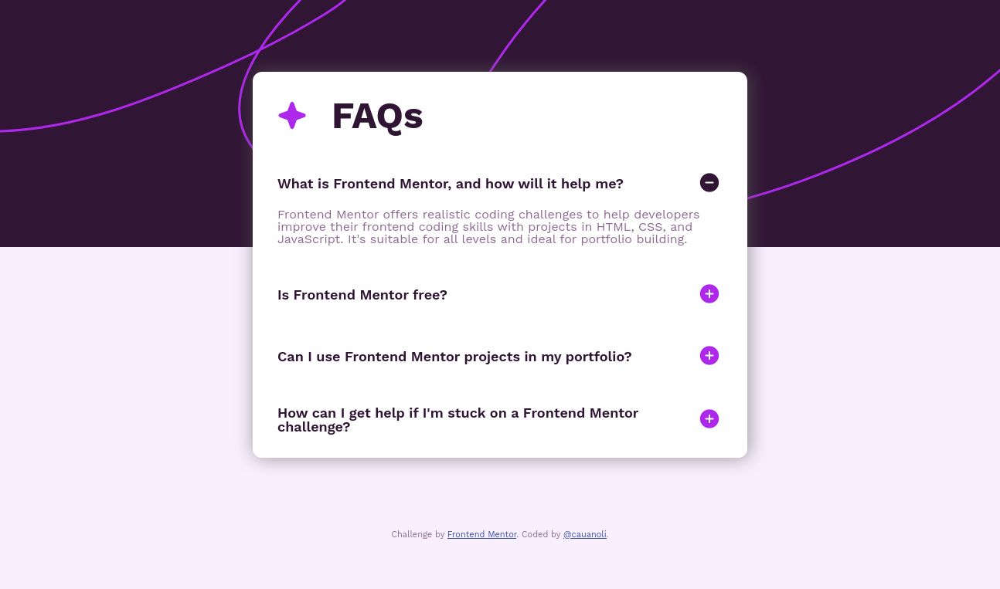

# Frontend Mentor - FAQ accordion solution

This is a solution to the [FAQ accordion challenge on Frontend Mentor](https://www.frontendmentor.io/challenges/faq-accordion-wyfFdeBwBz). Frontend Mentor challenges help you improve your coding skills by building realistic projects. 

## Table of contents

- [Overview](#overview)
  - [The challenge](#the-challenge)
  - [Screenshot](#screenshot)
  - [Links](#links)
- [My process](#my-process)
  - [Built with](#built-with)
  - [What I learned](#what-i-learned)
  - [Continued development](#continued-development)
  - [Useful resources](#useful-resources)

**Note: Delete this note and update the table of contents based on what sections you keep.**

## Overview

### The challenge

Users should be able to:

- Hide/Show the answer to a question when the question is clicked
- Navigate the questions and hide/show answers using keyboard navigation alone
- View the optimal layout for the interface depending on their device's screen size
- See hover and focus states for all interactive elements on the page

### Screenshot



### Links

- Solution URL: [Solution](https://github.com/cauanoli/challenge-faq-accordion)
- Live Site URL: [Live preview](https://cauanoli.github.io/challenge-faq-accordion/)

## My process

### Built with

- Semantic HTML5 markup
- CSS custom properties
- Flexbox
- CSS Grid
- Mobile-first workflow

### What I learned

Using the details HTML element and customizing it in open state.


```html
<details class="details">
  <summary class="details__summary">
    What is Frontend Mentor, and how will it help me?
    <span class="details__summary__icon"></span>
  </summary>
  <p class="details__content">
    Frontend Mentor offers realistic coding challenges to help
    developers improve their frontend coding skills with projects in
    HTML, CSS, and JavaScript. It's suitable for all levels and ideal for portfolio building.
  </p>
</details>
```
```css
.details[open] .details__summary__icon::after {
  background-image: url("../assets/images/icon-minus.svg");
}
```

### Continued development

In future projects I want to focus more on semantic HTML and responsive CSS design.

### Useful resources

- [MDN \<details\>: The Details disclosure element](https://developer.mozilla.org/en-US/docs/Web/HTML/Element/details) - MDN is a great resource for learning anything about Web development, and this page about the details element helped me a lot in this project.
